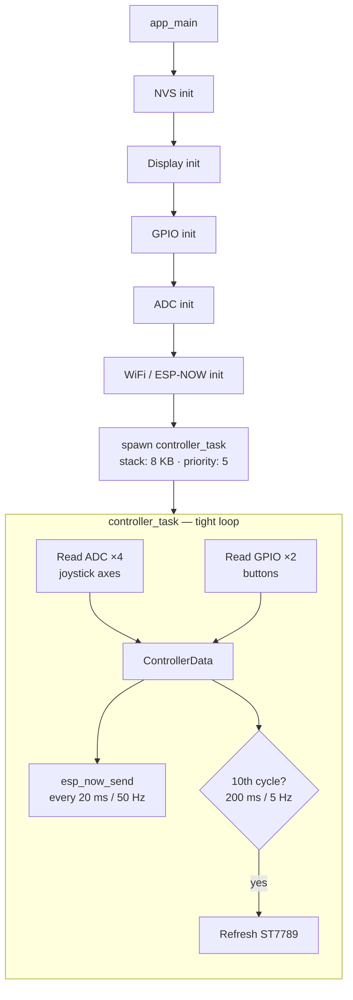
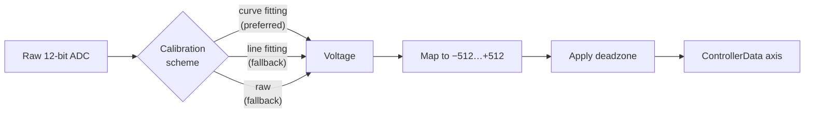
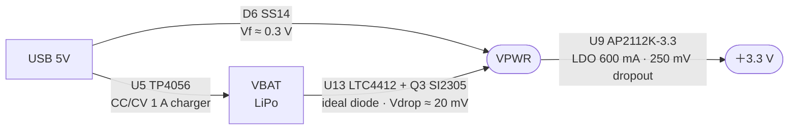

# CLAUDE.md

This file provides guidance to Claude Code (claude.ai/code) when working with code in this repository.

## Project Overview

An ESP32-based wireless game controller using ESP-NOW for low-latency peer-to-peer communication. Reads two analog joysticks and transmits data to a receiver. Features an ST7789 SPI display showing live joystick values.

## Architecture

- **Hardware**: ESP32-WROVER-KIT, native ESP-IDF (no Arduino)
- **Protocol**: ESP-NOW (no pairing, channel 1, no encryption)
- **Display**: ST7789 320×240 SPI — driven by `main/st7789_display.c`

### Data flow



`ControllerData` struct (7 bytes sent over ESP-NOW):
```c
typedef struct {
    int16_t joy1_x, joy1_y;
    int16_t joy2_x, joy2_y;
    bool joy1_btn, joy2_btn;
    uint8_t batteryLevel;  // hardcoded to 100 — not yet implemented
} ControllerData;
```

Joystick calibration pipeline:



### Components

- **`main/main.c`**: application entry point and controller loop
- **`main/st7789_display.c` / `.h`**: ST7789 SPI driver with built-in 8×8 ASCII font (2× scale), RGB565 colors

The `backup/` directory contains the original Arduino/PlatformIO implementation (Ukrainian comments) — useful as a reference for the earlier pin layout.

## Common Development Commands

```bash
idf.py menuconfig        # configure receiver MAC, send delay, deadzone
idf.py build
idf.py flash
idf.py monitor
idf.py build flash monitor
idf.py size              # check flash/RAM usage
idf.py set-target esp32  # only needed when switching targets
idf.py fullclean         # removes sdkconfig too
```

## Configuration Parameters

`idf.py menuconfig` → "ESP32 Controller Configuration":
- **Receiver MAC Address** — default `FF:FF:FF:FF:FF:FF` (broadcast)
- **Send Delay (ms)** — range 10–1000, default 20
- **Joystick Deadzone** — range 10–200, default 50

## Hardware Pin Assignments

### Joysticks (PS5-style Hall-effect)
| Signal | GPIO | ADC |
|---|---|---|
| Joystick 1 X | GPIO36 | ADC1_CH0 |
| Joystick 1 Y | GPIO39 | ADC1_CH3 |
| Joystick 1 Button | GPIO25 | — |
| Joystick 2 X | GPIO34 | ADC1_CH6 |
| Joystick 2 Y | GPIO35 | ADC1_CH7 |
| Joystick 2 Button | GPIO26 | — |

Buttons use internal pull-up; active-low logic is inverted in software.

### ST7789 Display (SPI / VSPI)
| Signal | GPIO |
|---|---|
| SCK | GPIO18 |
| MOSI | GPIO23 |
| CS | GPIO5 |
| DC | GPIO2 |
| RST | GPIO4 |
| Backlight | GPIO15 |

## Power Supply Design (supply.kicad_sch)

Automatic USB/battery switching — no manual intervention required.

### Topology



- **When USB present**: D6 conducts (VPWR ≈ 4.7V), Q3 is reverse-biased by LTC4412 → battery isolated
- **When USB absent**: Q3 conducts (VPWR ≈ VBAT − 20mV), D6 reverse-biased → battery powers system

### Components

| Ref | Part | Package | Function |
|---|---|---|---|
| U5 | TP4056-42-ESOP8 | ESOP-8 | LiPo charger (1A, CC/CV) |
| D5 | — | — | removed; replaced by LTC4412 + Q3 (SI2305) |
| D6 | SS14 | SMA | USB path diode |
| U13 | LTC4412ES6 (marking: **LTA2**) | TSOT-23-6 | PowerPath controller |
| Q3 | SI2305 | SOT-23 | P-ch MOSFET (VDS −20V, ID −4.1A, RDS 105–130mΩ) |
| U9 | AP2112K-3.3 | SOT-23-5 | LDO 3.3V, 600mA, 250mV dropout |

> Q1 and Q2 are NPN BJTs (BCW66G) used by the CH340C UART auto-reset circuit, so the PowerPath PMOS is **Q3**.

### LTC4412 wiring
- VIN + SENSE → VBAT
- GATE → Q3 (SI2305) Gate (net `Q1_GATE`)
- CTL → VIN (always enabled)
- STAT → not connected
- Q3 (SI2305): Source → VBAT, Drain → VPWR
- PWR_FLAG #FLG04 on VPWR (declares the rail as externally supplied for ERC)

### Why AP2112K instead of AMS1117
AMS1117 has 1.3V dropout — cannot regulate from LiPo (needs ≥4.6V in).
AP2112K has 250mV dropout — works at VPWR = 3.72V (VBAT 3.7V − 20mV Q3).

### TP4056 notes
- TEMP pin → VCC (not GND) when no NTC thermistor used; TEMP=GND permanently disables charging
- EPAD → GND
- CC1/CC2 on USB-C connector → 5.1kΩ pull-downs to GND (sink mode, required for USB-C chargers)
- ~STDBY (pin 6) is `no_connect` — no charge-complete LED indicator wired in this design

### ERC pin-type tweaks (embedded library copies)
A few stock symbols had `pin_type` annotations that triggered ERC false-positives once the supply network was complete. The **embedded** copies in the schematic file have been adjusted (the upstream libraries are unchanged, hence the resulting `lib_symbol_mismatch` warnings are expected):
- `Simulation_SPICE:NPN` — Q1/Q2 collector & emitter `open_collector`/`open_emitter` → `passive`
- `PCM_yvolodym:8205A` — D1/D2 drains `output` → `passive`
- `Interface_USB:CH340C` — V3 pin `power_output` → `power_input` (CH340C runs in self-power mode with V3 tied to VCC externally)

## Key Notes

- ADC uses `esp_adc/adc_oneshot` API with automatic calibration (curve fitting preferred, falls back to line fitting, then raw).
- WiFi is initialized in STA mode solely to enable the ESP-NOW radio — no network association.
- Battery level is **not implemented** (`batteryLevel` is hardcoded to 100).
- `sdkconfig.defaults` enables SPIRAM, 240 MHz CPU, 80 MHz flash/SPIRAM, and WiFi buffer tuning.
- Hardware reference datasheets are in `doc/`.
