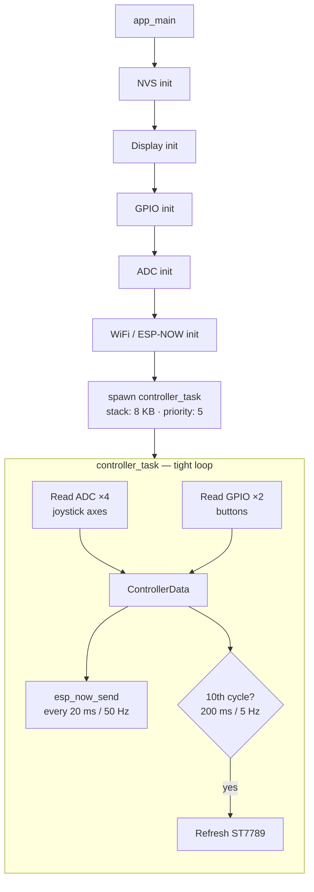
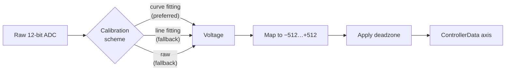
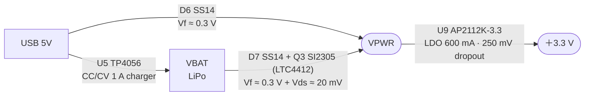

# CLAUDE.md

This file provides guidance to Claude Code (claude.ai/code) when working with code in this repository.

## Project Overview

An ESP32-based wireless game controller using ESP-NOW for low-latency peer-to-peer communication. Reads two analog joysticks and transmits data to a receiver. Features an ST7789 SPI display showing live joystick values.

## Architecture

- **Hardware**: ESP32-WROVER-KIT, native ESP-IDF (no Arduino)
- **Protocol**: ESP-NOW (no pairing, channel 1, no encryption)
- **Display**: ST7789 320×240 SPI — driven by `main/st7789_display.c`

### Data flow



`ControllerData` struct (7 bytes sent over ESP-NOW):
```c
typedef struct {
    int16_t joy1_x, joy1_y;
    int16_t joy2_x, joy2_y;
    bool joy1_btn, joy2_btn;
    uint8_t batteryLevel;  // hardcoded to 100 — not yet implemented
} ControllerData;
```

Joystick calibration pipeline:



### Components

- **`main/main.c`**: application entry point and controller loop
- **`main/st7789_display.c` / `.h`**: ST7789 SPI driver with built-in 8×8 ASCII font (2× scale), RGB565 colors

The `backup/` directory contains the original Arduino/PlatformIO implementation (Ukrainian comments) — useful as a reference for the earlier pin layout.

## Common Development Commands

```bash
idf.py menuconfig        # configure receiver MAC, send delay, deadzone
idf.py build
idf.py flash
idf.py monitor
idf.py build flash monitor
idf.py size              # check flash/RAM usage
idf.py set-target esp32  # only needed when switching targets
idf.py fullclean         # removes sdkconfig too
```

## Configuration Parameters

`idf.py menuconfig` → "ESP32 Controller Configuration":
- **Receiver MAC Address** — default `FF:FF:FF:FF:FF:FF` (broadcast)
- **Send Delay (ms)** — range 10–1000, default 20
- **Joystick Deadzone** — range 10–200, default 50

## Hardware Pin Assignments

### Joysticks (PS5-style Hall-effect)

Physical placement (from schematic): **U2 = right stick**, **U3 = left stick**.
The firmware names `joy1` = U2 (right) and `joy2` = U3 (left); the display
labels `RIGHT` (line for joy1) and `LEFT` (line for joy2) match this mapping.

| Signal | GPIO | WROVER pin name | Module pin # | ADC |
|---|---|---|---|---|
| Joystick 1 (RIGHT, U2) X — net `/VRx` | GPIO32 | GPIO32 | 8 | ADC1_CH4 |
| Joystick 1 (RIGHT, U2) Y — net `/VRy` | GPIO33 | GPIO33 | 9 | ADC1_CH5 |
| Joystick 1 (RIGHT, U2) Button | GPIO25 | GPIO25 | 10 | — |
| Joystick 2 (LEFT,  U3) X — net `/HRx` | GPIO34 | GPIO34 | 6 | ADC1_CH6 |
| Joystick 2 (LEFT,  U3) Y — net `/HRy` | GPIO35 | GPIO35 | 7 | ADC1_CH7 |
| Joystick 2 (LEFT,  U3) Button | GPIO26 | GPIO26 | 11 | — |

Buttons use internal pull-up; active-low logic is inverted in software.

> SENSOR_VP (GPIO36, module pin 4) and SENSOR_VN (GPIO39, module pin 5) are
> **not connected** in the schematic — explicit `no_connect` markers at U1.
> Earlier firmware versions read joy1 from GPIO36/39, which produced floating
> ADC values and a stick that "did not react"; fixed by moving joy1 to
> GPIO32/33 (the pins the schematic actually wires to U2).

### ST7789 Display (SPI / VSPI)
| Signal | GPIO |
|---|---|
| SCK | GPIO18 |
| MOSI | GPIO23 |
| CS | GPIO5 |
| DC | GPIO2 |
| RST | GPIO4 |
| Backlight | GPIO15 |

## Power Supply Design (supply.kicad_sch)

Automatic USB/battery switching — no manual intervention required.

### Requirements

1. **USB connected** → ESP32 is powered from USB **and** the LiPo cell is charged.
2. **USB disconnected** → ESP32 is powered from the LiPo cell.
3. The crossover between USB and battery must happen **automatically**, with **no external control** (no switch, no MCU GPIO, no jumper). It must be fully analog/self-contained on the supply schematic.

### Topology



D7 is an inline Schottky between VBAT and Q3 source. It blocks Q3's intrinsic body-diode from injecting current into the battery whenever USB pulls VPWR above VBAT — without this diode the TP4056 charge path is bypassed during bulk charging. Cost: an extra ~0.3 V drop in the battery → load path; see voltage budget below.

- **When USB present**: D6 conducts (VPWR ≈ 4.7V), Q3 is reverse-biased by LTC4412 → battery isolated
- **When USB absent**: Q3 conducts (VPWR ≈ VBAT − 20mV), D6 reverse-biased → battery powers system

### Components

| Ref | Part | Package | Function |
|---|---|---|---|
| U5 | TP4056-42-ESOP8 | ESOP-8 | LiPo charger (1A, CC/CV) |
| D5 | — | — | removed; replaced by LTC4412 + Q3 (SI2305) |
| D6 | SS14 | SMA | USB path diode |
| D7 | SS14 | SMA | Battery path series Schottky — blocks Q3 body-diode reverse current |
| U13 | LTC4412ES6 (marking: **LTA2**) | TSOT-23-6 | PowerPath controller |
| Q3 | SI2305 | SOT-23 | P-ch MOSFET (VDS −20V, ID −4.1A, RDS 105–130mΩ) |
| U9 | AP2112K-3.3 | SOT-23-5 | LDO 3.3V, 600mA, 250mV dropout |

> Q1 and Q2 are NPN BJTs (BCW66G) used by the CH340C UART auto-reset circuit, so the PowerPath PMOS is **Q3**.

### LTC4412 wiring
- VIN → VBAT (chip is powered from the battery so it remains alive when USB is absent)
- SENSE → VPWR (load-side / Q3 drain — required for the chip to detect when USB pulls VPWR above VBAT and turn Q3 off; do **not** tie SENSE to VBAT)
- CTL → GND (CTL is active-low: low or open allows the PFET to switch normally; CTL high *forces* the PFET off — datasheet Description and CTL section, V_IH ≥ 0.9 V)
- GATE → Q3 (SI2305) Gate (net `Q1_GATE`)
- STAT → not connected
- Q3 (SI2305): Source → VBAT, Drain → VPWR
- PWR_FLAG #FLG04 on VPWR (declares the rail as externally supplied for ERC)

### Why AP2112K instead of AMS1117
AMS1117 has 1.3V dropout — cannot regulate from LiPo (needs ≥4.6V in).
AP2112K has 250mV dropout — usable across the LiPo range, but only marginally now that D7 is inline; see budget below.

### Battery-path voltage budget (with D7 inline)

VPWR (battery side) = VBAT − Vf(D7) − Vds(Q3) ≈ VBAT − 0.32 V at light load.

| VBAT | VPWR | AP2112K +3.3V output | Notes |
|---|---|---|---|
| 4.20 V (full) | ≈ 3.88 V | 3.30 V (in regulation) | margin 330 mV |
| 3.70 V (nominal) | ≈ 3.38 V | ≈ 3.13 V (in dropout) | ESP32 still functional |
| 3.30 V (low) | ≈ 2.98 V | ≈ 2.73 V | below ESP32 brown-out (~3.0 V), system shuts down |

D7's ~0.3 V drop costs roughly 0.3 V of usable battery range compared to a no-Schottky design. If that becomes a problem, two options that don't have the dropout penalty: (a) replace D7 with a low-Vf SBR (e.g. SBR05U30LP, Vf ≈ 0.21 V at 0.5 A), or (b) drop D7 entirely and add a back-to-back PMOS pair so neither body diode can conduct in the unwanted direction.

### TP4056 notes
- TEMP pin → VCC (not GND) when no NTC thermistor used; TEMP=GND permanently disables charging
- EPAD → GND
- CC1/CC2 on USB-C connector → 5.1kΩ pull-downs to GND (sink mode, required for USB-C chargers)
- ~STDBY (pin 6) is `no_connect` — no charge-complete LED indicator wired in this design

### Verification against requirements (status: 2026-05-08)

Source of truth: `kicad-cli sch export netlist --format kicadsexpr` against `kicad/esp32-controller.kicad_sch`. Reviewed only the schematic, not the PCB.

**What is correctly implemented:**
- USB → VPWR path: D6 (SS14) anode on VBUS, cathode on VPWR; AP2112K Vin/EN tied to VPWR. Forward-biased with USB present, reverse-biased without. ✓
- TP4056 charge path: VBUS → U5 V_CC, CE tied high (always enabled), TEMP tied high (NTC disabled by design), PROG resistor sets I_CHG. BAT pin → VBAT through DW01A + 8205A protection cell. Charges whenever USB is present. ✓
- VPWR → +3.3V via U9 AP2112K-3.3, EN tied to Vin (regulator always on). ✓
- Switching strategy is fully analog (LTC4412 + PMOS + Schottky); no GPIO, switch, or jumper involved → satisfies the "no external control" requirement at the topology level. ✓

**Resolved — `U13` SENSE pin wiring (fixed 2026-05-08):**

Per the LTC4412 datasheet (Figure 1 and Electrical Characteristics V_FR / V_RTO), `SENSE` must be connected to the **load side of the external PMOS** (i.e. Q3 drain = VPWR). The chip switches the PMOS off when `V_SENSE − V_IN > 20 mV` — that is what gives "auxiliary supply detected → disconnect battery from load".

Previously `SENSE` (U13 pin 6) was tied to **VBAT** (same net as VIN + CTL). With that wiring the chip could not detect USB presence and kept Q3 fully on, short-circuiting the TP4056 charge path through Q3's channel.

The fix relabelled U13's SENSE stub wire to `VPWR` and added a matching `VPWR` net label on the D6→AP2112K rail, so SENSE now joins the same net as Q3 drain, D6 cathode, and U9 Vin/EN. Verified via `kicad-cli sch export netlist`: U13 pin 6 is on `/supply/VPWR`; VBAT contains only VIN, CTL, Q3 source, and the TP4056 BAT pin.

**Resolved — PMOS body-diode path (fixed 2026-05-08):**

D7 (SS14) was added in series between VBAT and Q3 source (anode = VBAT, cathode = Q3 source). The Schottky is reverse-biased whenever VPWR > VBAT, so Q3's body-diode current path back into the battery is blocked. Verified via netlist: `Net-(D7-K)` contains exactly D7 K and Q3 S; VBAT now contains D7 A in place of the former direct Q3-source connection. Trade-off: ~0.3 V additional drop in the battery → load path, documented in the voltage budget table above.

**Resolved — U12 CTL pin tied to VBAT (fixed 2026-05-08):**

The LTC4412 CTL pin is active-low: a logic high *forces* the external PFET off (datasheet, Description, page 1: "The control (CTL) input enables the user to force the primary MOSFET off"). Previously U12 pin 3 (CTL) was wired to the same net as VIN (VBAT, ≈ 3.7–4.2 V) — well above V_IH = 0.9 V — so the chip held GATE deasserted and Q3 was permanently off. With USB unplugged the load saw no battery path and the system did not power up.

The fix removed the vertical stub between U12 pin 1 and pin 3 and tied CTL directly to GND via a power symbol. Verified via netlist: U12 pin 3 (CTL) is now on `GND`; VBAT no longer lists U12 pin 3.

### ERC pin-type tweaks (embedded library copies)
A few stock symbols had `pin_type` annotations that triggered ERC false-positives once the supply network was complete. The **embedded** copies in the schematic file have been adjusted (the upstream libraries are unchanged, hence the resulting `lib_symbol_mismatch` warnings are expected):
- `Simulation_SPICE:NPN` — Q1/Q2 collector & emitter `open_collector`/`open_emitter` → `passive`
- `PCM_yvolodym:8205A` — D1/D2 drains `output` → `passive`
- `Interface_USB:CH340C` — V3 pin `power_output` → `power_input` (CH340C runs in self-power mode with V3 tied to VCC externally)

## Key Notes

- ADC uses `esp_adc/adc_oneshot` API with automatic calibration (curve fitting preferred, falls back to line fitting, then raw).
- WiFi is initialized in STA mode solely to enable the ESP-NOW radio — no network association.
- Battery level is **not implemented** (`batteryLevel` is hardcoded to 100).
- `sdkconfig.defaults` enables SPIRAM, 240 MHz CPU, 80 MHz flash/SPIRAM, and WiFi buffer tuning.
- Hardware reference datasheets are in `doc/`.
