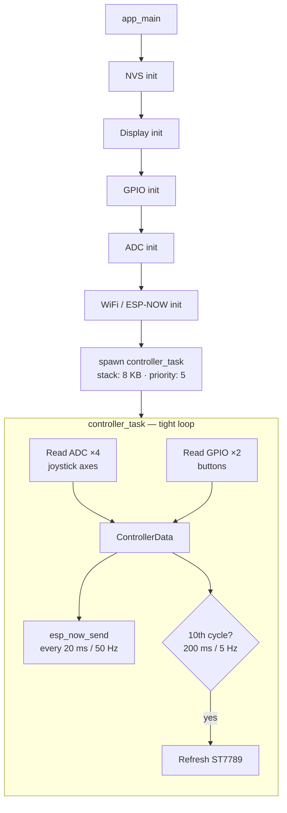
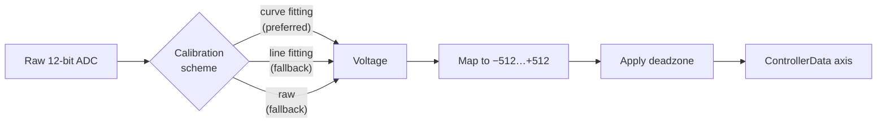

# CLAUDE.md

This file provides guidance to Claude Code (claude.ai/code) when working with code in this repository.

## Project Overview

An ESP32-based wireless game controller using ESP-NOW for low-latency peer-to-peer communication. Reads two analog joysticks and transmits data to a receiver. Features an ST7789 SPI display showing live joystick values.

## Architecture

- **Hardware**: ESP32-WROVER-KIT, native ESP-IDF (no Arduino)
- **Protocol**: ESP-NOW (no pairing, channel 1, no encryption)
- **Display**: ST7789 320×240 SPI — driven by `main/st7789_display.c`

### Data flow



`ControllerData` struct (sent over ESP-NOW):
```c
typedef struct {
    int16_t joy1_x, joy1_y;
    int16_t joy2_x, joy2_y;
    bool joy1_btn, joy2_btn;
    uint8_t batteryLevel;
} ControllerData;
```

`batteryLevel` is derived in software from a 220 kΩ / 100 kΩ divider on `HVBAT`
(R17/R18/C9 in `supply.kicad_sch`) feeding GPIO36 / ADC1_CH0 (SENSOR_VP).
Mapping is linear: 4200 mV → 100 %, 3000 mV → 0 %.

Joystick calibration pipeline:



### Components

- **`main/main.c`**: application entry point and controller loop
- **`main/st7789_display.c` / `.h`**: ST7789 SPI driver with built-in 8×8 ASCII font (2× scale), RGB565 colors

The `backup/` directory contains the original Arduino/PlatformIO implementation (Ukrainian comments) — useful as a reference for the earlier pin layout.

## Common Development Commands

```bash
idf.py menuconfig        # configure receiver MAC, send delay, deadzone
idf.py build
idf.py flash
idf.py monitor
idf.py build flash monitor
idf.py size              # check flash/RAM usage
idf.py set-target esp32  # only needed when switching targets
idf.py fullclean         # removes sdkconfig too
```

## Configuration Parameters

`idf.py menuconfig` → "ESP32 Controller Configuration":
- **Receiver MAC Address** — default `FF:FF:FF:FF:FF:FF` (broadcast)
- **Send Delay (ms)** — range 10–1000, default 20
- **Joystick Deadzone** — range 10–200, default 50

## Hardware Pin Assignments

### Joysticks (resistive / potentiometer-based)

Physical placement (from schematic): **U2 = right stick**, **U3 = left stick**.
The firmware names `joy1` = U2 (right) and `joy2` = U3 (left); the display
labels `RIGHT` (line for joy1) and `LEFT` (line for joy2) match this mapping.

| Signal | GPIO | WROVER pin name | Module pin # | ADC |
|---|---|---|---|---|
| Joystick 1 (RIGHT, U2) X — net `VRx` | GPIO32 | GPIO32 | 8 | ADC1_CH4 |
| Joystick 1 (RIGHT, U2) Y — net `VRy` | GPIO33 | GPIO33 | 9 | ADC1_CH5 |
| Joystick 1 (RIGHT, U2) Button | GPIO25 | GPIO25 | 10 | — |
| Joystick 2 (LEFT,  U3) X — net `HRx` | GPIO34 | GPIO34 | 6 | ADC1_CH6 |
| Joystick 2 (LEFT,  U3) Y — net `HRy` | GPIO35 | GPIO35 | 7 | ADC1_CH7 |
| Joystick 2 (LEFT,  U3) Button | GPIO26 | GPIO26 | 11 | — |

Buttons use internal pull-up; active-low logic is inverted in software.

> **Joystick buttons are not wired in hardware (status 2026-06-03).** All four
> SEL+/SEL− pins on U2 and U3 carry explicit `no_connect` markers, and the
> matching ESP32 pins (GPIO25 pin 10, GPIO26 pin 11) are also marked
> `no_connect` on U1. The firmware still configures both GPIOs as inputs with
> internal pull-ups and reads them every cycle, so they always report HIGH
> (i.e. "not pressed"). The button logic in software is correct and ready —
> only the schematic/PCB is missing the routes.

> SENSOR_VN (GPIO39, module pin 5) is **not connected** in the schematic —
> explicit `no_connect` marker at U1. SENSOR_VP (GPIO36, module pin 4) is the
> ADC tap of the VBAT divider (R17/R18/C9, net `HVBAT`). Earlier firmware
> versions read joy1 from GPIO36/39, which produced floating ADC values and a
> stick that "did not react"; fixed by moving joy1 to GPIO32/33 (the pins the
> schematic actually wires to U2).

#### Measured deflection range (post-calibration, after boot zero-reference)

The firmware maps each axis to nominal **−512…+512** with a deadzone around
zero (see `calibrateJoystick` in `main/main.c`). Measured per-axis full-swing
extremes on the current hardware (resistive thumbstick modules with two
potentiometers per stick) are:

| Joystick | X min | X max | Y min | Y max |
|---|---|---|---|---|
| RIGHT (joy1, U2) | −464 | +453 | −476 | +441 |
| LEFT  (joy2, U3) | −479 | +439 | −461 | +457 |

These are useful for downstream model/vehicle control: the sticks don't reach
the theoretical ±512 limit, so any actuator-mapping curve should clamp/scale
against the table above rather than ±512. Values are asymmetric (offset of
~10–20 counts between positive and negative directions) — apply per-direction
scaling if symmetric output is required.

### ST7789 Display (SPI / VSPI)

8-pin header J1 (`Conn_01x08_Pin`, schematic location top-of-board):

| J1 pin | Signal | GPIO |
|---|---|---|
| 1 | Backlight | GPIO15 |
| 2 | CS  | GPIO5  |
| 3 | DC  | GPIO2  |
| 4 | RST | GPIO4  |
| 5 | MOSI / SDA | GPIO23 |
| 6 | SCK / SCL  | GPIO18 |
| 7 | VCC | +3.3 V |
| 8 | GND | GND |

## Power Supply Design (supply.kicad_sch)

Automatic USB/battery switching — no manual intervention required. Reference
designators below match the current schematic exactly (verified by walking
`supply.kicad_sch` 2026-06-03).

### Requirements

1. **USB connected** → ESP32 is powered from USB **and** the Li-ion cell is charged.
2. **USB disconnected** → ESP32 is powered from the Li-ion cell (NCR18650B).
3. The crossover between USB and battery must happen **automatically**, with **no external control** (no switch, no MCU GPIO, no jumper). It must be fully analog/self-contained on the supply schematic.

### Topology


D6 is an inline Schottky between VBAT and Q3 source. It blocks Q3's intrinsic
body diode from injecting current into the battery whenever USB pulls VPWR
above VBAT — without this diode the TP4056 charge path would be bypassed
during bulk charging. Cost: an extra ~0.3 V drop in the battery → load path;
see voltage budget below.

- **When USB present**: D5 conducts (VPWR ≈ +5 V − Vf ≈ 4.7 V), the LTC4412 senses VPWR > VBAT and turns Q3 off → battery isolated.
- **When USB absent**: LTC4412 turns Q3 on, current flows VBAT → D6 → Q3.S → Q3.D → VPWR (≈ VBAT − 0.3 V); D5 is reverse-biased.

### Components

| Ref | Part | Package | Function |
|---|---|---|---|
| U5  | TP4056-42-ESOP8 | SOIC-8 EP | Li-ion charger, 1 A CC/CV, 4.2 V |
| U6  | USBLC6-2P6 | SOT-23-6 | USB D+/D− ESD protection |
| U7  | 8205A | SOT-23-6 | Dual N-MOSFET, battery protection switch |
| U8  | DW01A | SOT-23-6 | Single-cell Li-ion protection IC (drives U7) |
| U9  | tactile switch (small) | — | (mechanical, see schematic) |
| U10 | NCR18650B holder | — | 18650 Li-ion cell, 3.6 V nominal, 4.2 V max |
| U11 | AP2112K-3.3 | SOT-23-5 | LDO 3.3 V, 600 mA, 250 mV dropout |
| U12 | LTC4412ES6 (marking **LTA2**) | TSOT-23-6 | PowerPath controller |
| Q3  | Si2319CDS | SOT-23 | P-ch MOSFET (VDS −40 V, ID −4.4 A, RDS_on ≈ 100 mΩ at VGS −10 V) |
| D5  | SS14 | SMA | USB-side Schottky (VBUS → VPWR) |
| D6  | SS14 | SMA | Battery-side Schottky (VBAT → Q3 source) |
| D3  | LED red | 0603 | TP4056 ~CHRG indicator (lit while charging) |
| D4  | LED blue | 0603 | +3.3 V power-on indicator |

> Q1 and Q2 (BCW66G NPN BJTs) live on the **main** schematic and are part of
> the CH340C UART auto-reset circuit. The supply schematic only contains Q3.

### LTC4412 (U12) wiring
- **VIN (pin 1) → VBAT** — the chip is powered from the battery so it stays alive when USB is absent.
- **GND (pin 2) → GND**.
- **CTL (pin 3) → GND** — CTL is active-low; tying it high *forces* the PFET off (V_IH ≥ 0.9 V per datasheet).
- **STAT (pin 4) → not connected**.
- **GATE (pin 5) → Q3 gate** (net `Q1_GATE` — the name is historical, this is Q3's gate, not Q1's).
- **SENSE (pin 6) → VPWR** — load side of Q3 (Q3 drain). The chip switches Q3 off when V_SENSE − V_IN > 20 mV, which is how it detects "USB has pulled VPWR above VBAT".
- PWR_FLAG `#FLG04` on VPWR (declares the rail as externally supplied for ERC).

### Q3 PMOS (Si2319CDS)
- Source → D6 cathode (battery-side Schottky), anode of D6 → VBAT.
- Drain → VPWR.
- Gate → `Q1_GATE` (driven by U12 GATE).

### Why AP2112K instead of AMS1117
AMS1117 has 1.3 V dropout — cannot regulate from a depleted Li-ion cell
(needs ≥ 4.6 V in). AP2112K has 250 mV dropout — usable across the cell
range, but only marginally with D6 inline; see budget below.

### Battery-path voltage budget

VPWR (battery side) = VBAT − Vf(D6) − Vds(Q3) ≈ VBAT − 0.32 V at light load.

| VBAT | VPWR | AP2112K +3.3V output | Notes |
|---|---|---|---|
| 4.20 V (full) | ≈ 3.88 V | 3.30 V (in regulation) | margin 330 mV |
| 3.70 V (nominal) | ≈ 3.38 V | ≈ 3.13 V (in dropout) | ESP32 still functional |
| 3.30 V (low) | ≈ 2.98 V | ≈ 2.73 V | below ESP32 brown-out (~3.0 V), system shuts down |

D6's ~0.3 V drop costs roughly 0.3 V of usable battery range compared to a
no-Schottky design. If that becomes a problem, two options without the
dropout penalty: (a) replace D6 with a low-Vf SBR (e.g. SBR05U30LP, Vf ≈
0.21 V at 0.5 A), or (b) drop D6 entirely and add a back-to-back PMOS pair
so neither body diode can conduct in the unwanted direction.

### TP4056 (U5) notes
- TEMP (pin 1) → VCC — NTC disabled by design (TEMP = GND would permanently disable charging).
- CE (pin 8) → VCC — charger always enabled when VBUS is present.
- ~CHRG (pin 7) → D3 (red LED) via R10 to +5 V — lit while charging.
- ~STDBY (pin 6) → no-connect — no charge-complete LED is wired in this design.
- EPAD (pin 9) → GND.
- VBUS / VCC (pin 4) → +5 V via the USB connector.
- BAT (pin 5) → VBAT through the DW01A + 8205A protection cell.
- USB-C connector P1: CC1/CC2 each have a 5.1 kΩ pull-down to GND (sink-mode requirement).

### VBAT sense to MCU
A 220 kΩ / 100 kΩ divider (R17/R18) with 100 nF filter (C9) taps `HVBAT` and
feeds GPIO36 (SENSOR_VP, ADC1_CH0) on U1. `HVBAT` is the same net as VBAT,
brought across as a hierarchical sheet pin. The firmware's `read_battery_level`
samples this divider and maps 4200 mV → 100 %, 3000 mV → 0 % linearly.

> Caveat: the divider taps the VBAT rail *after* the protection cell, not the
> raw cell. Under load the LTC4412/Q3/D6/protection FET path causes a visible
> drop, so the reading underestimates SoC during current spikes (boot, WiFi
> start). Documented behaviour, not a bug.

### ERC pin-type tweaks (embedded library copies)
A few stock symbols had `pin_type` annotations that triggered ERC false
positives once the supply network was complete. The **embedded** copies in
the schematic file have been adjusted (the upstream libraries are unchanged,
hence the resulting `lib_symbol_mismatch` warnings are expected):
- `Simulation_SPICE:NPN` — Q1/Q2 collector & emitter `open_collector` / `open_emitter` → `passive`
- `PCM_yvolodym:8205A` — D1/D2 drains `output` → `passive`
- `Interface_USB:CH340C` — V3 pin `power_output` → `power_input` (CH340C runs in self-powered mode with V3 tied to VCC externally)

## Key Notes

- ADC uses `esp_adc/adc_oneshot` API with automatic calibration (curve fitting preferred, falls back to line fitting, then raw).
- WiFi is initialized in STA mode solely to enable the ESP-NOW radio — no network association.
- Battery level is computed from the GPIO36 / `HVBAT` divider (see *Power Supply Design → VBAT sense to MCU*).
- `sdkconfig.defaults` enables SPIRAM, 240 MHz CPU, 80 MHz flash/SPIRAM, and WiFi buffer tuning.
- Hardware reference datasheets are in `doc/`.
